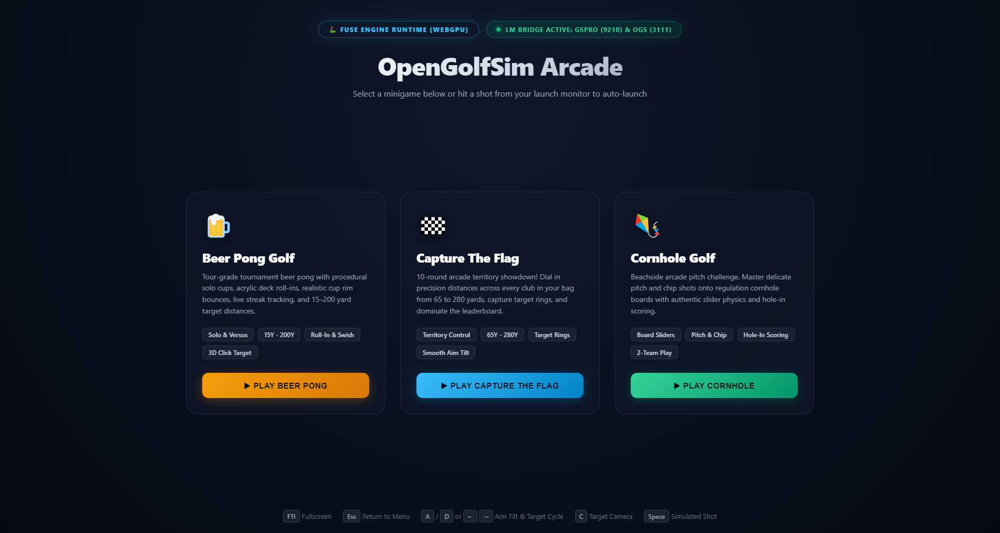
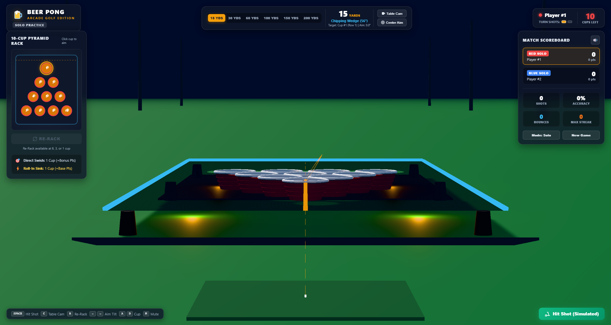
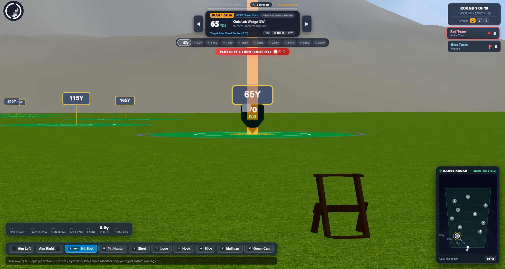
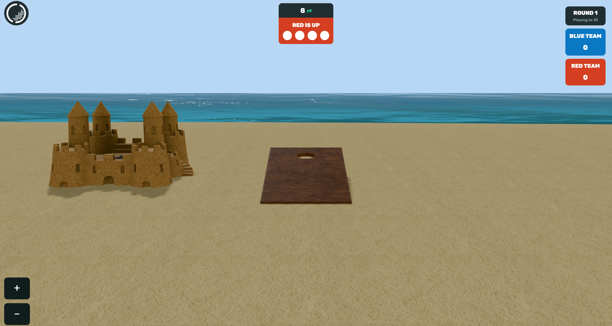
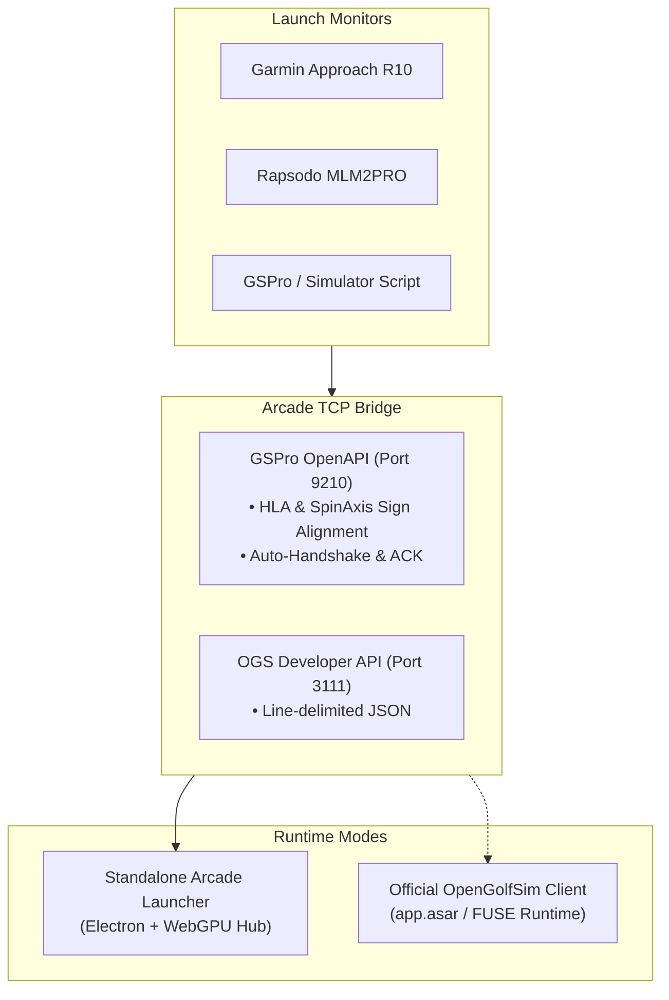

# OpenGolfSim Arcade ⛳🍻🚩

[-brightgreen.svg)](#)
[](#)
[](#launch-monitor-support)
[](#cross-platform-quickstart)
[](LICENSE)

**OpenGolfSim Arcade** is a tour-quality arcade minigame suite engineered for the **FUSE** (Three.js WebGPU / Rapier3D WASM) engine in [OpenGolfSim](https://github.com/Daniel-Uzcategui/ogs).

It features direct hardware integration with radar and camera launch monitors (including **Garmin Approach R10**, **Rapsodo MLM2PRO**, and any **GSPro OpenAPI** compatible system), tournament physics with roll-in/swish detection, and support for both standalone play and native embedding in the official OpenGolfSim desktop launcher.

---



---

## 🎮 Included Minigames

| Game | Preview | Key Features |
| :--- | :---: | :--- |
| **🍺 Beer Pong Golf**<br>Tournament beer pong into 10 solo cups. |  | • 15Y to 200Y Target Distances<br>• Swish & Rim-Bounce Physics<br>• Interactive 3D Click-to-Target<br>• Mountain Vista Style Aim Tilt |
| **🚩 Capture The Flag**<br>10-round showdown across all clubs. |  | • 65Y to 280Y Flag Distances<br>• Territory Control Rings<br>• Real-time Leaderboards<br>• Dynamic Wind & Lie Variations |
| **🎯 Cornhole Golf**<br>Beachside pitching & chipping challenge. |  | • Authentic Board Slider Physics<br>• Hole-in-One 3-Point Scoring<br>• 2-Team Competitive Match<br>• Distance Tuning |

---

## 🏗️ Architecture & Dual-Mode Support



Games can be played in **two ways**:
1. **Standalone Arcade Hub**: Run the dedicated high-performance Electron launcher with built-in launch monitor TCP servers and live connection status.
2. **Official OpenGolfSim Launcher**: Install games with 1-click directly into your system's OpenGolfSim installation (`~/.config/opengolfsim-desktop/fuse/` on Linux or `%APPDATA%\opengolfsim-desktop\fuse\` on Windows).

---

## 🚀 Quickstart

### Prerequisites
* [Node.js](https://nodejs.org/) (v18 or higher recommended)
* Git

### On Windows
```cmd
git clone https://github.com/Daniel-Uzcategui/opengolfsim-arcade.git
cd opengolfsim-arcade

:: 1. Run the installer (installs dependencies and creates desktop shortcut)
scripts\windows\install.bat

:: 2. Launch OpenGolfSim Arcade
scripts\windows\start_arcade.bat
```

### On Linux (Ubuntu / Debian / Arch)
```bash
git clone https://github.com/Daniel-Uzcategui/opengolfsim-arcade.git
cd opengolfsim-arcade

# 1. Run installer
bash scripts/linux/install.sh

# 2. Launch OpenGolfSim Arcade
bash scripts/linux/start_arcade.sh
```

---

## 📦 Install into Official OpenGolfSim Desktop App

Want the arcade minigames to show up directly inside the standard OpenGolfSim desktop client?

* **Windows**:
  ```powershell
  npm run install:ogs:win
  ```
* **Linux**:
  ```bash
  npm run install:ogs:linux
  ```

Once installed, simply launch your standard `OpenGolfSim.exe` or `opengolfsim-desktop` application. Beer Pong, Capture The Flag, and Cornhole will appear directly in your game selection list.

---

## 📡 Launch Monitor Connection

The built-in bridge listens on:
* **Port 9210**: GSPro Open API (Springbok Connector, MLM2PRO-GSPro-Connector, MuniGolf, etc.)
* **Port 3111**: OpenGolfSim Developer API

### Garmin Approach R10 Configuration:
1. Ensure your PC running OpenGolfSim Arcade and your launch monitor connector are on the same local network.
2. In your connector settings, set:
   * **Target IP**: IP address of your OpenGolfSim PC (e.g. `192.168.1.154` or `127.0.0.1`)
   * **Target Port**: `9210`
3. Launch OpenGolfSim Arcade — the top connection pill will turn green (`LAUNCH MONITOR CONNECTED`).
4. Any swing detected by your launch monitor is immediately simulated with true-to-life physics.
5. If you hit a ball while at the main menu, the game automatically launches Beer Pong and dispatches your shot!

---

## ⌨️ Controls & Keybindings

| Key | Action |
| :--- | :--- |
| <kbd>F11</kbd> | Toggle Fullscreen |
| <kbd>Esc</kbd> | Return to Arcade Hub Menu |
| <kbd>&larr;</kbd> / <kbd>&rarr;</kbd> | Smooth Camera Aim Tilt (8° / sec) |
| <kbd>A</kbd> / <kbd>D</kbd> or <kbd>&uarr;</kbd> / <kbd>&darr;</kbd> | Cycle Target Cup / Flag |
| <kbd>C</kbd> | Target Close-Up Camera |
| <kbd>Space</kbd> | Fire Simulated Test Shot |
| Mouse Left-Click | Direct 3D Raycasting Target Selection |

---

## 📚 Technical Documentation

* 📖 **[Developer Guide & Physics Reference](docs/DEVELOPER_GUIDE.md)**: Three.js WebGPU + Rapier3D WASM physics pipeline, proof of HLA/SpinAxis sign mapping, relative aim math, and how to build new minigames.
* 🖥️ **[Regular Launcher Integration](docs/REGULAR_LAUNCHER_INTEGRATION.md)**: Metadata schemas (`game.json`), discovery mechanics, and filesystem layout.
* 📡 **[Launch Monitor Setup](docs/LAUNCH_MONITOR_SETUP.md)**: Port 9210 / 3111 protocol specifications, payload examples, and test scripts.
* 🤖 **[AI Agent Instructions](docs/AGENT_INSTRUCTIONS.md)**: Guidelines, rules, and prompt patterns for AI agents (Cursor, Antigravity, Claude, Copilot).

---

## 📄 License

This project is licensed under the [MIT License](LICENSE).
OpenGolfSim and FUSE are open source projects maintained by the golf simulation community.
